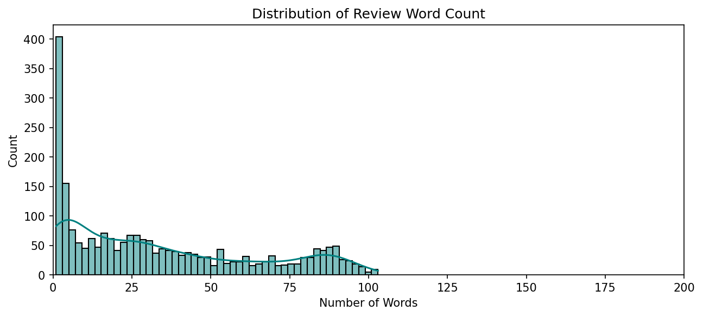
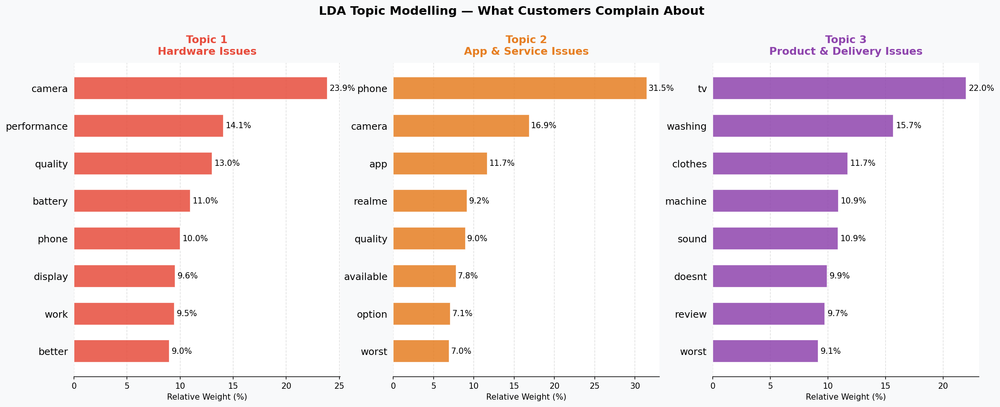

# 🛒 Customer Sentiment Analysis on Flipkart Product Reviews

---

## 📌 Overview
An end-to-end **NLP and Machine Learning** project that analyzes **2,296 real Flipkart customer reviews** to automatically classify sentiment as **Positive**, **Neutral**, or **Negative** — with deeper insights through VADER comparison, mismatch detection, and LDA topic modelling.

---

## 📂 Dataset
| Property | Detail |
|---|---|
| Total Reviews | 2,296 |
| Columns | Product_name · Review · Rating |
| Rating Scale | 1 to 5 Stars |
| Missing Values | 8 (removed) |

---

## 🛠️ Tech Stack
`Python` `Pandas` `NumPy` `NLTK` `Scikit-learn` `VADER` `Matplotlib` `Seaborn` `WordCloud` `Google Colab`

---

## 🤖 Models & Results
| Model | Accuracy | F1 Score |
|---|---|---|
| Logistic Regression | 88% | 90% |
| Naive Bayes | 84% | 77% |
| **Random Forest** ✅ | **90%** | **90%** |

---

## 🔍 Key Insights
- 🎯 **90% accuracy** achieved using Random Forest
- 🤖 **86.5% agreement** between ML model and VADER lexicon
- ⚠️ **93 mismatched reviews** detected — written text contradicted the star rating
- 🔴 LDA Topic Modelling revealed top complaints — **camera quality, battery life, delivery**
- 📏 Negative reviews are **significantly longer** than positive ones

---

## 📈 Visualisations

### Rating Distribution

### Review Word Count

### Word Cloud — Customer Language

### Confusion Matrix

### Model Comparison

### VADER vs ML Comparison

### Mismatch Analysis

### LDA Topic Modelling

---

## 🔄 Project Workflow
## 🔄 Project Workflow
` ` `
Data Loading → EDA → Text Preprocessing → Sentiment Labelling
→ TF-IDF Vectorization → Model Training → Evaluation
→ VADER Comparison → Mismatch Detection → LDA Topic Modelling
→ Live Predictor
` ` `

---

## 🚀 How to Run
1. Open `majorproject.ipynb` in Google Colab
2. Click **Runtime → Run All**
3. Dataset loads automatically — no uploads needed

---

👤 **Author:** Aditi Singh  
🎓 *Data Science Capstone Project · LaunchED Global Internship · May 2026*
